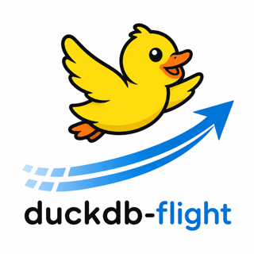

# duckdb-flight

Query Arrow Flight services from DuckDB.

Stop waddling files around. Let Flight carry the batches.

`flight` is a DuckDB extension for reading remote Arrow Flight streams
with ordinary SQL. The goal is simple: keep DuckDB delightful for local analysis
while letting governed, high-throughput data services hand it Arrow batches
directly.

Status: post-MVP implementation. The extension builds as `flight`, loads
locally, and passes fixture-backed Rust and SQLLogic tests for metadata, schema
inspection, descriptor scans, and ticket scans. Descriptor scans bind their
schema from `FlightInfo` and open endpoint streams during execution, preserving
opaque endpoint tickets as bytes. Ticket scans can also stream when supplied a
`schema_descriptor`; otherwise they prebuffer because a bare ticket does not
expose a bind-time schema.

Community extension readiness: the local build, crate name, workflow name, and
descriptor template now target `flight`. A real community release still needs a
public GitHub repo/ref and a PR adding `extensions/flight/description.yml` to the
DuckDB Community Extensions Repository.

## Why This Should Exist

DuckDB is wonderful at asking sharp local questions. Arrow Flight is wonderful
at moving columnar data across a service boundary. This project is the small
bridge between those two worlds:

```sql
INSTALL flight FROM community;
LOAD flight;

SELECT *
FROM flight('grpc://localhost:5005', ['warehouse', 'events'])
LIMIT 100;
```

The intended feeling is: the data lives elsewhere, but the question still feels
local.

## First Five Minutes

Use the built-in fixture when you just want to see the extension breathe:

```sql
LOAD './build/debug/flight.duckdb_extension';

SELECT * FROM flight_check('fixture://events');
SELECT * FROM flight_list('fixture://events');
SELECT * FROM flight_schema('fixture://events', ['warehouse', 'events']);
SELECT * FROM flight('fixture://events', ['warehouse', 'events']);

-- A tiny real-data fixture from the public Vega Seattle weather dataset.
SELECT weather, round(sum(precipitation), 1) AS precipitation
FROM flight('fixture://seattle-weather', ['public', 'seattle_weather'])
GROUP BY weather
ORDER BY precipitation DESC;

-- A tiny public non-human biology fixture from Palmer penguins.
SELECT species, count(*) AS penguins, round(avg(body_mass_g), 1) AS avg_body_mass_g
FROM flight('fixture://palmer-penguins', ['bio', 'palmer_penguins'])
GROUP BY species
ORDER BY species;
```

Against a real Flight service, the intended happy path is the same:

```sql
-- Is the service reachable?
SELECT * FROM flight_check('grpc://localhost:5005');

-- What can I query?
SELECT * FROM flight_list('grpc://localhost:5005');

-- What shape is this dataset?
SELECT *
FROM flight_schema('grpc://localhost:5005', ['warehouse', 'events']);

-- Bring a slice into DuckDB.
CREATE VIEW events AS
SELECT *
FROM flight('grpc://localhost:5005', ['warehouse', 'events']);

SELECT event_type, count(*)
FROM events
GROUP BY event_type
ORDER BY count(*) DESC;
```

If credentials are needed:

```sql
SELECT *
FROM flight(
  'grpc+tls://flight.example.com',
  ['warehouse', 'events'],
  bearer_token := getenv('FLIGHT_TOKEN'),
  timeout_ms := 30000
)
LIMIT 100;
```

## When To Use It

Use `flight` when the data boundary is a service:

- A governed data product.
- A remote query engine returning Arrow streams.
- A private-network or cross-cloud dataset.
- A result set partitioned across Flight endpoints.
- A curated slice you want to join locally with Parquet, Iceberg, Delta, Lance,
  DuckLake, CSV, or in-memory data.

Use native DuckDB scans when the files or table format are the product:

- `read_parquet(...)` for direct Parquet access.
- `iceberg`, `delta`, `lance`, or `ducklake` for native lakehouse tables.
- Existing DuckDB filesystem and secrets support when DuckDB should own the I/O.

Short version: use native DuckDB scans when you can; use Flight when you need a
service boundary.

## Design Priorities

- Friendly SQL first: `flight(...)` should be the front door.
- Discovery before scan: list, inspect, then query.
- Bounded memory: descriptor scans stream batches; ticket scans stream when a
  schema descriptor is supplied.
- Honest pushdown: optimize only where behavior is explicit and testable.
- Useful diagnostics: auth, TLS, endpoint, ticket, and schema errors should be
  clear enough to fix.
- Arrow-native internals: preserve the streaming model instead of row-by-row
  thinking.
- DuckDB-native ergonomics: table functions, SQLLogic tests, compact examples,
  and predictable extension packaging.

## Implemented SQL Surface

```sql
SELECT * FROM flight_check('grpc://localhost:5005');
SELECT * FROM flight_list('grpc://localhost:5005');
SELECT * FROM flight_schema('grpc://localhost:5005', ['warehouse', 'events']);
SELECT * FROM flight('grpc://localhost:5005', ['warehouse', 'events']);
```

Lower-level tools should stay available:

```sql
SELECT *
FROM flight_scan(
  'grpc://localhost:5005',
  descriptor_type := 'path',
  descriptor := ['warehouse', 'events']
);

SELECT *
FROM flight_scan_ticket(
  'grpc://localhost:5005',
  ticket := '...',
  schema_descriptor := ['warehouse', 'events']
);

-- For opaque/non-text tickets, copy ticket_hex from flight_info.
SELECT *
FROM flight_scan_ticket(
  'grpc://localhost:5005',
  ticket := '00ff61',
  ticket_encoding := 'hex',
  schema_descriptor := ['warehouse', 'events']
);
```

Later:

```sql
SELECT *
FROM flight_sql(
  'grpc+tls://query.example.com',
  'select * from warehouse.events limit 100'
);
```

## Developer Experience Goals

The project should be easy to join. Today:

- `cargo test` runs Rust unit tests, including an in-process tiny Flight server
  that emits real Arrow Flight `FlightData` streams over gRPC, including a small
  public Seattle weather sample, a small Palmer penguins biology sample, and
  binary endpoint-ticket coverage.
- `make configure debug` builds the loadable DuckDB extension.
- `make test_debug` runs offline fixture-backed SQLLogic tests for extension
  loading and SQL behavior.
- `fixture://events`, `fixture://seattle-weather`, and
  `fixture://palmer-penguins` provide offline demo data.

Still planned:

- `make demo` starts a local Flight server and opens a DuckDB shell.
- `make bench` reports latency to first row, throughput, and memory shape.
- `flight_check(...)` tells users whether the problem is connectivity, auth,
  TLS, service support, or query shape.
- Fixtures cover happy paths and intentionally annoying protocol edges.
- Docs show complete copy-pasteable SQL, not only API signatures.

## Current Docs

- [Design Plan](docs/design.md)
- [SQL Specification](SPEC.md)
- [Community Extension Release Notes](docs/release/community-extension.md)

Possible follow-up artifacts:

- `ARCHITECTURE.md`: component boundaries and runtime choices.
- `ROADMAP.md`: phased implementation checklist.
